# Tower Defense Game

A simple (but challenging!) and fun Tower Defense game built with Godot game engine.

## Try it
- [https://rampart-defense.github.io/TowerDefense/](https://rampart-defense.github.io/TowerDefense/)
  
## How to use
- Download the latest Godot game engine (This project uses V.4.4.1): https://godotengine.org
- Clone this repository into your own folder
- Open the repository folder in Godot
- play the demo from the debug button (Play button in the top-right corner)
- In the future we will release a playable build of the game here in Github

## Features
- Main Menu: A main menu lets you start a new game and access other options.
- Background music for every map and main menu
- Up to 80 unique, progressively difficult waves
- Boss rounds every 10 waves
- 8 unique towers to defend your base with
- 7 unique maps, ranging from very easy to extremely difficult

## Towers
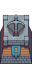
- Archery tower
	- The basic crossbow tower shoots up to 3 powerful arrow projectiles dealing medium damage with medium speed.

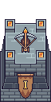
- Sniper tower
	- Shoots slow firing, high damaging bolts. Great for high priority targets.

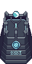
- Flame tower
	- Fires extremely fast low damage flameballs in a small range.

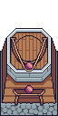
- Slingshot tower
	- This tower lobs explosive projectiles, dealing high damage to a large group of enemies.

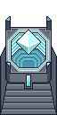
- Lightning tower
	- These slow firing, medium damage lightning bolts stun and halt enemy movement for a short while in a large radius.

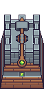
- Catapult tower
	- Launches high damaging, penetrating projectiles dealing massive damage to enemies in straight lines.

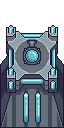
- Cannonball tower
	- Upgrade this tower to shoot powerfull cannonballs up to 4 different directions.

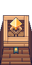
- Buffer tower
	- Place this tower to upgrade the damage and firing speed of other towers in its range.

- PiggyBank tower
	- Generates passive gold based on a percentage of your currently held money. The more gold you have, the more gold it earns!

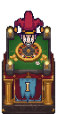
- IncomeJoker tower
	- A gambling tower with a 50/50 chance each cycle to either generate gold (like the PiggyBank) or restore your health (based on the current difficulty).

## Maps
- Frostbite Fields
  -	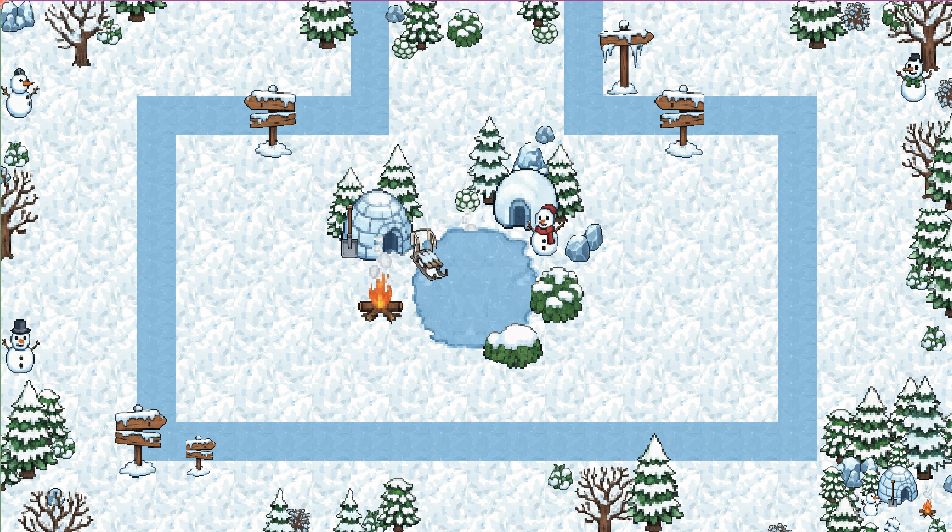
	- This winter themed map offers many straight lines for powerful defensive strategies.
- Scorched Sands
  -	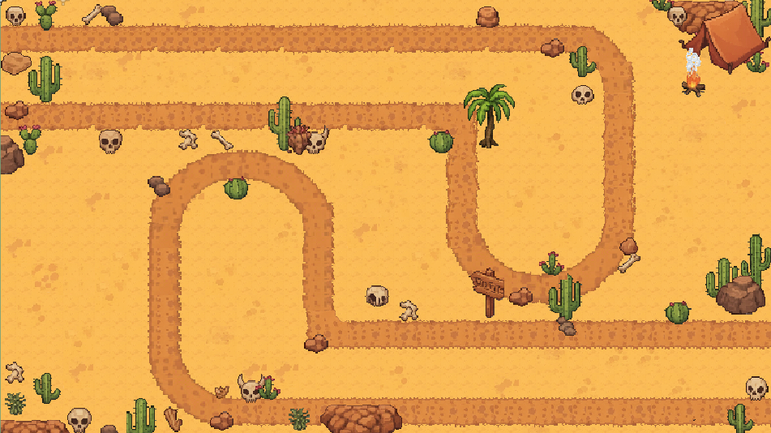
	- This desert themed maps offers two different paths for the enemies to spawn on, forcing you to think about effective tower placement.
- Oasis
  -	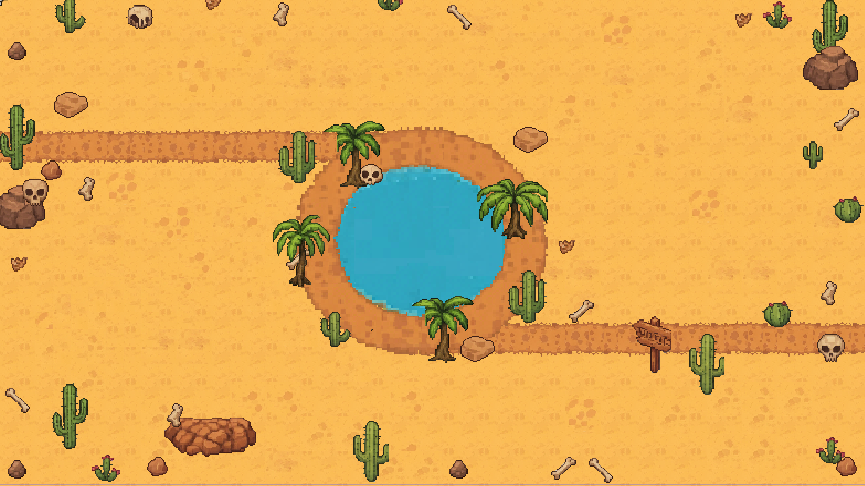
	- This desert themed map has enemies running around in a loop at the center of the map.
- Nature's Edge
  -	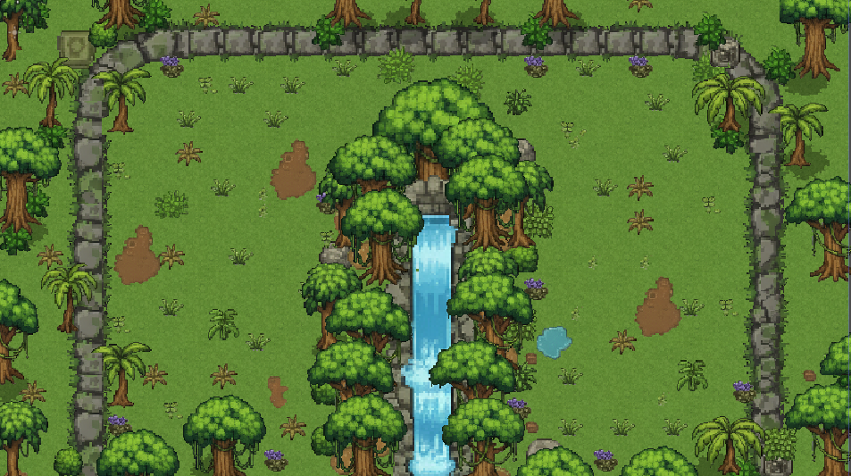
	- This jungle themed map offers long straight lines, but be careful about where you decide to place the towers.
- Amber Fall
  -	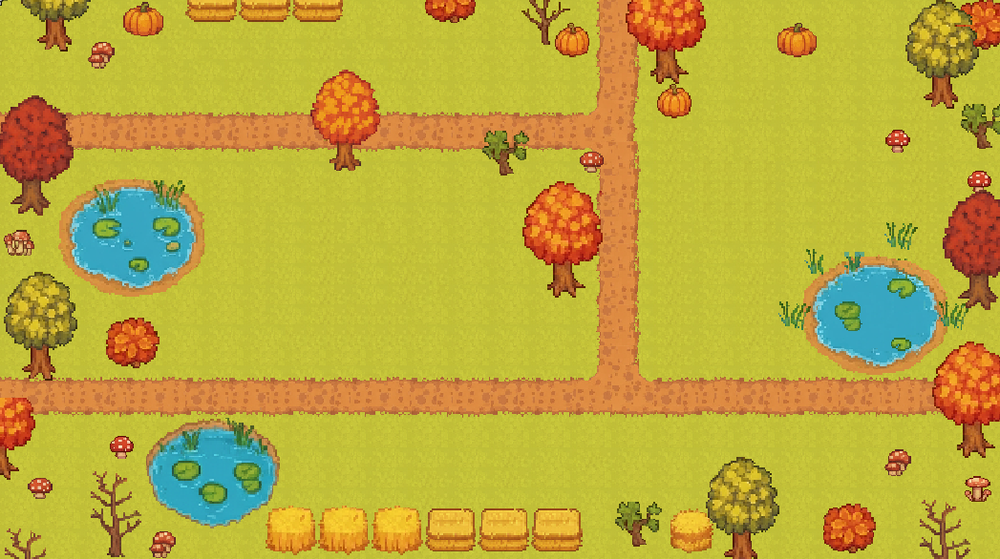
	- This autumn themed map offers two very short, merging lanes.
- Crossroads Of Doom
  -	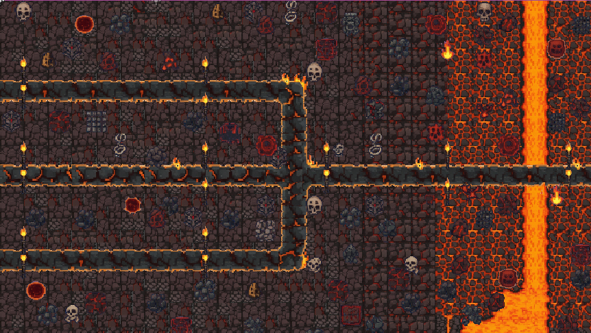
	- The litmus test. The hardest map in the game centers around a hellish theme with three converging paths for enemies to spawn on.
- Crystal Caverns
  -	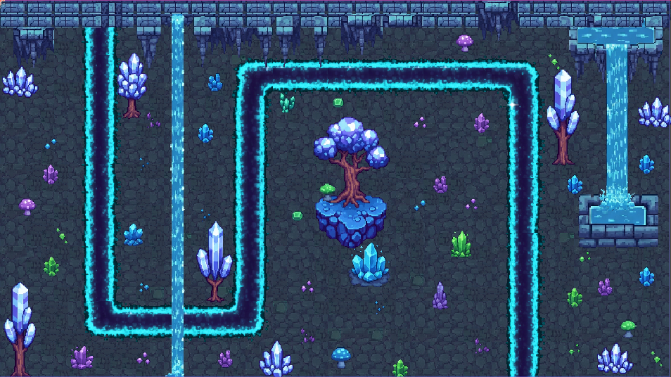
	- These glistening caves offer straight lines for effective defense.
-  Verdant Meadow
    - 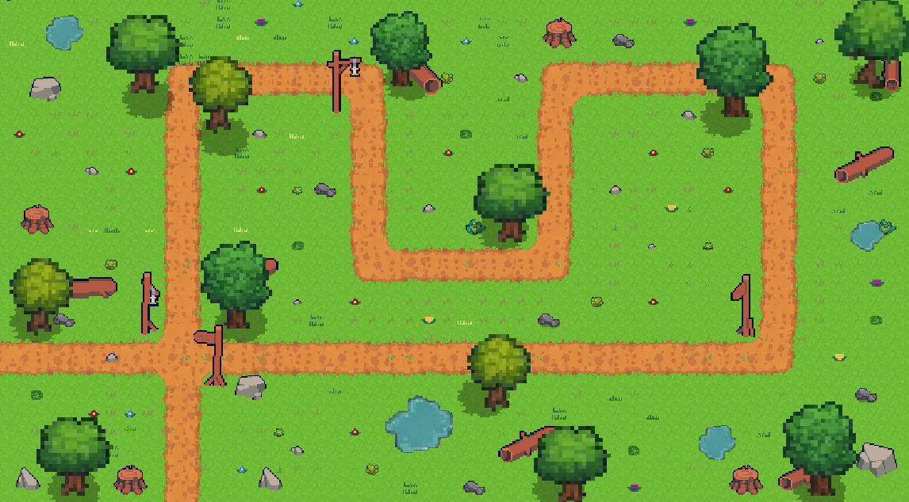
    - This map offers a forest themed setting with a calming soundtrack.
- Gemwood Grotto
  - 
  - Continuation of Crystal Caverns, fight goblins in this hourglass shaped map coming from both ends.
---
## Gameplay
- Main Menu: From the main menu, select the Start Game option to begin your tower defense adventure.
- Placing Turrets: On each level, buy turrets from the shop to place your turrets. Each turret automatically attacks enemies within its range.
- Winning: Prevent enemies from reaching your base and survive all the waves to win the level!
